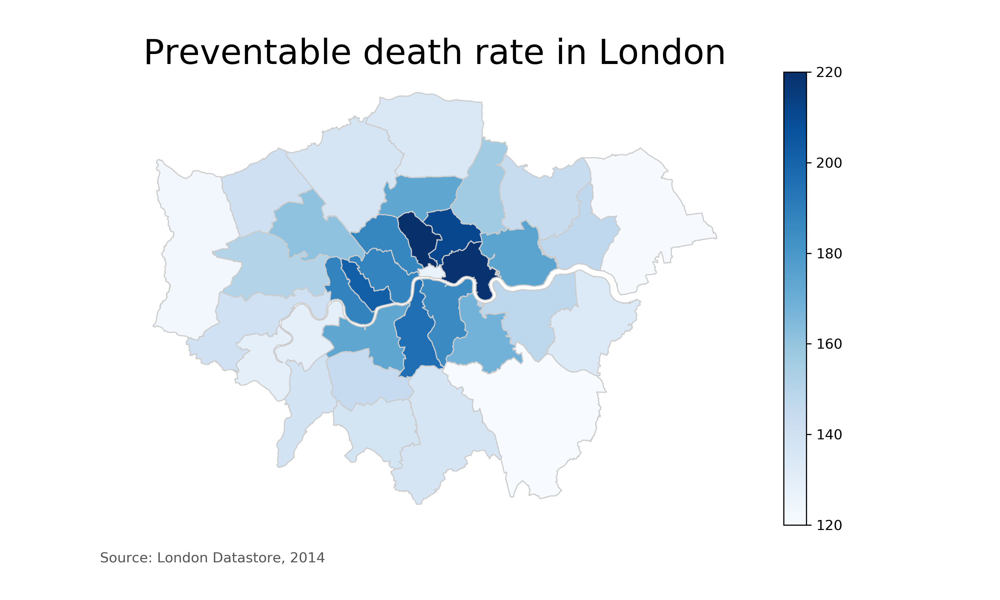

# make-a-map-geopandas

So you want to make a map using Python. Let's get started!

This is a tutorial on how to make a choropleth map using Geopandas and Matplotlib in Python. By the end of this walk through (or by simply downloading the repo and running the code), you'll be able to make a map like this using Python and Geopandas.

All code is stored in the Jupyter Notebook above. You can read the full write-up tutorial here on Medium.

